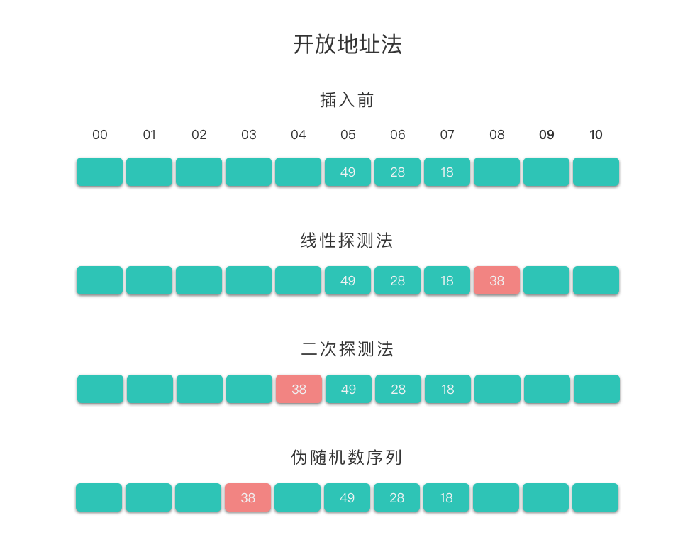

# 哈希表
## 1. 概念
- 哈希表：hash table,又称散列表。也叫做散列表。是根据关键码值（Key Value）直接进行访问的数据结构。
- 哈希表通过键(key)和映射函数 Hash(key) 计算出对应的值(value)，把关键码值映射到表中一个位置来访问记录，以加快查找的速度。这个映射函数叫做哈希函数（散列函数），存放记录的数组叫做哈希表（散列表）。
- 向哈希表输入一个键key，则可以在O(1)时间内获取对应的值value。
- 实例：学号和学生姓名的关系，输入一个学号就可以快速得到学生名字。
## 2. 时间复杂度的对比
- 查找元素：哈希表是O(1),数组和链表是O(n);
- 插入元素：哈希表是O(1),数组和链表是O(n)或者是O(1);
- 删除元素：哈希表是O(1),数组和链表是O(n)或者是O(1);
  * 数组和链表的插入或者删除元素的时间复杂度是O(1)时，均是在尾部操作。
## 3. 哈希表的关键思想
- 是使用哈希函数，将键 key 映射到对应表的某个区块中。我们可以将算法思想分为两个部分：
  * **向哈希表中插入一个关键码值**：哈希函数决定该关键字的对应值应该存放到表中的哪个区块，并将对应值存放到该区块中。
  * **在哈希表中搜索一个关键码值**：使用相同的哈希函数从哈希表中查找对应的区块，并在特定的区块搜索该关键字对应的值。
  
## 4. 哈希函数
- 定义
  * （Hash Function）：将哈希表中元素的关键键值映射为元素存储位置的函数。
- 一般来说，哈希函数会满足以下几个条件：
  * 哈希函数应该易于计算，并且尽量使计算出来的索引值均匀分布。
  * 哈希函数计算得到的哈希值是一个固定长度的输出值。
  * 如果 Hash(key1) 不等于 Hash(key2)，那么 key1、key2 一定不相等。
  * 如果 Hash(key1) 等于 Hash(key2)，那么 key1、key2 可能相等，也可能不相等（会发生哈希碰撞）。
- 通常用到的**哈希函数方法**有：直接定址法、除留余数法、平方取中法、基数转换法、数字分析法、折叠法、随机数法、乘积法、点积法等。下面我们介绍几个常用的哈希函数方法。
### 4.1 直接定址法原理
- 取关键字本身 / 关键字的某个线性函数值 作为哈希地址。即：Hash(key) = key 或者 Hash(key) = a * key + b，其中 a 和 b 为常数。
- 该方法计算最简单，且不会产生冲突。
- 适合于关键字分布基本连续的情况，如果关键字分布不连续，空位较多，则会造成存储空间的浪费。
### 4.2 除留余数法
- 假设哈希表的表长为 m，取一个不大于 m 但接近或等于 m 的质数 p，利用取模运算，将关键字转换为哈希地址。即：Hash(key) = key % p，其中 p 为不大于 m 的质数。
- 该方法关键点在于 p 的选择。根据经验而言，一般 p 取素数或者 m，这样可以尽可能的减少冲突。
### 4.3 平方取中法
- 先通过求关键字平方值的方式扩大相近数之间的差别，然后根据表长度取关键字平方值的中间几位数为哈希地址。即：Hash(key) = (key * key) / 10^(n-1)，其中 n>= 1,即Hash(key) = 中间几位数，其中中间几位数为关键字平方值的中间几位数。
- 该方法适合于关键字分布不连续的情况。
### 4.4 基数转换法
- 将关键字看成另一种进制的数再转换成原来进制的数，然后选其中几位作为哈希地址。
### 4.5 其他方法
- 数字分析法、折叠法、随机数法、乘积法、点积法等
## 5. 哈希冲突
- Hash Collision：不同的关键字通过同一个哈希函数可能得到同一哈希地址，即 key1 ≠ key2，而 Hash(key1) = Hash(key2)，这种现象称为哈希冲突。
- 理想状态下，我们的哈希函数是完美的一对一映射，即一个关键字（key）对应一个值（value），不需要处理冲突。
- 但是一般情况下，不同的关键字 key 可能对应了同一个值 value，这就发生了哈希冲突。
- 设计再好的哈希函数也无法完全避免哈希冲突。所以就需要通过一定的方法来解决哈希冲突问题。常用的**哈希冲突解决方法**主要是两类：开放地址法（Open Addressing） 和 链地址法（Chaining）。
### 5.1 开放地址法
- Open Addressing：指的是将哈希表中的空地址向处理冲突开放。当哈希表未满时，处理冲突时需要尝试另外的单元，直到找到空的单元为止。
- 当发生冲突时，开放地址法按照下面的方法求得后继哈希地址：H(i) = (Hash(key) + F(i)) % m，i = 1, 2, 3, ..., n (n ≤ m - 1)。
* H(i) 是在处理冲突中得到的地址序列。即在第 1 次冲突（i = 1）时经过处理得到一个新地址 H(1)，如果在 H(1) 处仍然发生冲突（i = 2）时经过处理时得到另一个新地址 H(2) …… 如此下去，直到求得的 H(n) 不再发生冲突。
* Hash(key) 是哈希函数，m 是哈希表表长，对哈希表长取余的目的是为了使得到的下一个地址一定落在哈希表中。
* F(i) 是冲突解决方法，取法可以有以下几种：
线性探测法：F(i) = 1, 2, 3, ..., m - 1。
二次探测法：F(i) = 1^2, -1^2, 2^2, -2^2...。
伪随机数序列：F(i) = 伪随机数序列。
- 举例说明
例如，在长度为 11 的哈希表中已经填有关键字分别为 28、49、18 的记录（哈希函数为 Hash(key) = key % 11）。现在将插入关键字为 38 的新纪录。根据哈希函数得到的哈希地址为 5，产生冲突。接下来分别使用这三种冲突解决方法处理冲突。
* 使用线性探测法：得到下一个地址 H(1) = (5 + 1) % 11 = 6，仍然冲突；继续求出 H(2) = (5 + 2) % 11 = 7，仍然冲突；继续求出 H(3) = (5 + 3) % 11 = 8，8 对应的地址为空，处理冲突过程结束，记录填入哈希表中序号为 8 的位置。
* 使用二次探测法：得到下一个地址 H(1) = (5 + 1*1) % 11 = 6，仍然冲突；继续求出 H(2) = (5 - 1*1) % 11 = 4，4 对应的地址为空，处理冲突过程结束，记录填入哈希表中序号为 4 的位置。
* 使用伪随机数序列：假设伪随机数为 9，则得到下一个地址 H(1) = (9 + 5) % 11 = 3，3 对应的地址为空，处理冲突过程结束，记录填入哈希表中序号为 3 的位置。

### 5.2 链地址法
- 将具有相同哈希地址的元素（或记录）存储在同一个线性链表中。
- 链地址法是一种更加常用的哈希冲突解决方法。相比于开放地址法，链地址法更加简单。
- 假设哈希函数产生的哈希地址区间为 [0, m - 1]，哈希表的表长为 m。则可以将哈希表定义为一个有 m 个头节点组成的链表指针数组 T。
- 这样在插入关键字的时候，我们只需要通过哈希函数 Hash(key) 计算出对应的哈希地址 i，然后将其以链表节点的形式插入到以 T[i] 为头节点的单链表中。在链表中插入位置可以在表头或表尾，也可以在中间。如果每次插入位置为表头，则插入操作的时间复杂度为 $O(1)$。
- 而在在查询关键字的时候，我们只需要通过哈希函数 Hash(key) 计算出对应的哈希地址 i，然后将对应位置上的链表整个扫描一遍，比较链表中每个链节点的键值与查询的键值是否一致。查询操作的时间复杂度跟链表的长度 k 成正比，也就是 $O(k)$。对于哈希地址比较均匀的哈希函数来说，理论上讲，k = n // m，其中 n 为关键字的个数，m 为哈希表的表长。
- 举个例子来说明如何使用链地址法处理冲突。
  * 假设现在要存入的关键字集合 keys = [88, 60, 65, 69, 90, 39, 07, 06, 14, 44, 52, 70, 21, 45, 19, 32]。再假定哈希函数为 Hash(key) = key % 13，哈希表的表长 m = 13，哈希地址范围为 [0, m - 1]。将这些关键字使用链地址法处理冲突，并按顺序加入哈希表中（图示为插入链表表尾位置），最终得到的哈希表如下图所示。
  
### 5.3 两种方法比较
- 相对于开放地址法，采用链地址法处理冲突要多占用一些存储空间（主要是链节点占用空间）。但它可以减少在进行插入和查找具有相同哈希地址的关键字的操作过程中的平均查找长度。这是因为在链地址法中，待比较的关键字都是具有相同哈希地址的元素，而在开放地址法中，待比较的关键字不仅包含具有相同哈希地址的元素，而且还包含哈希地址不相同的元素。

